# Introduction à la géomorphologie

## Approche topographique des formes du relief

### Les montagnes

### Les plateaux

### Les plaines

## Approche géologique du relief

### La structure interne de la Terre

### La structure externe de la Terre : les roches

Les roches d'origine interne (ou endogènes ou ignites)
- Les roches plutonites (ou intrusives)
    - Le granite $\gamma$

    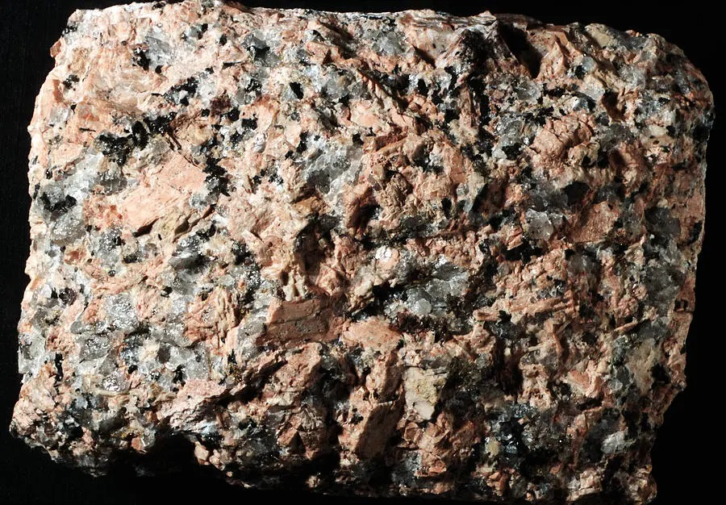

    - La syénite $\gamma\alpha$

    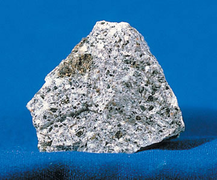

    - La diorite $\theta$

    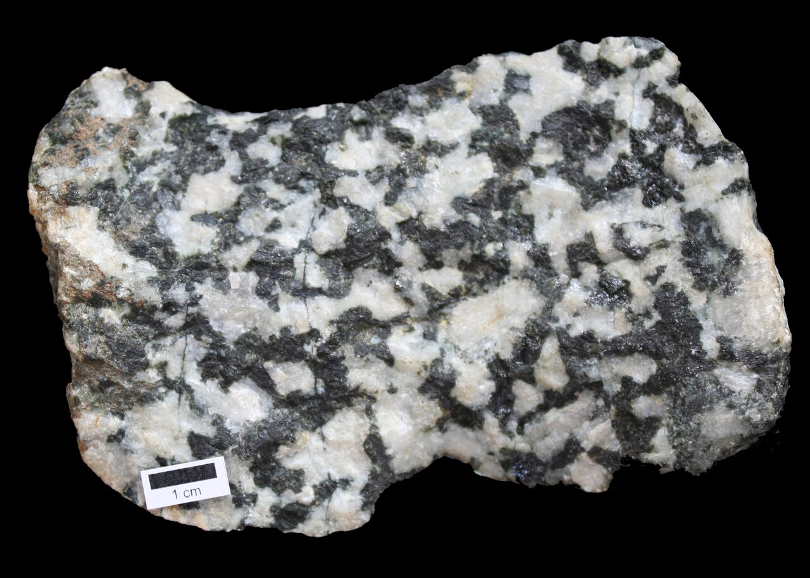

    - Le gabbro $\mu$

    

- Les roches vulcanites (ou volcaniques)
    - Récentes datant de l'ère tertiaire :
        - La rhyolite $\pi$ (rhyolithe)

        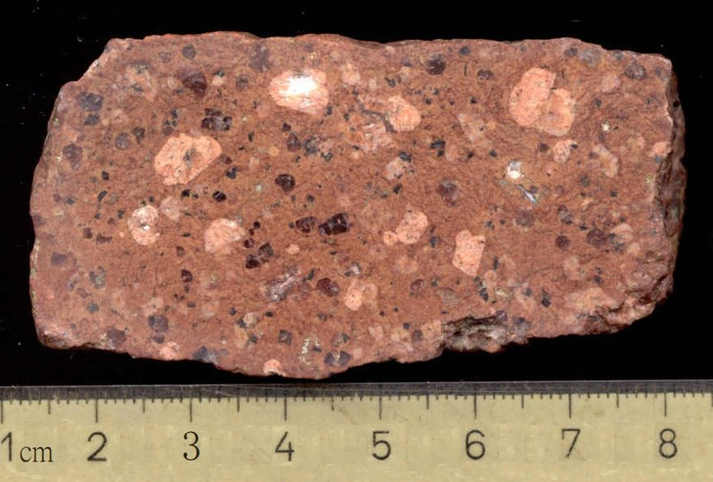

        - Le trachyte $\upsilon$

        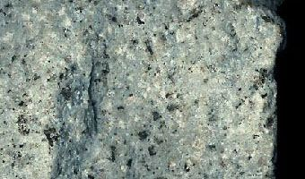

        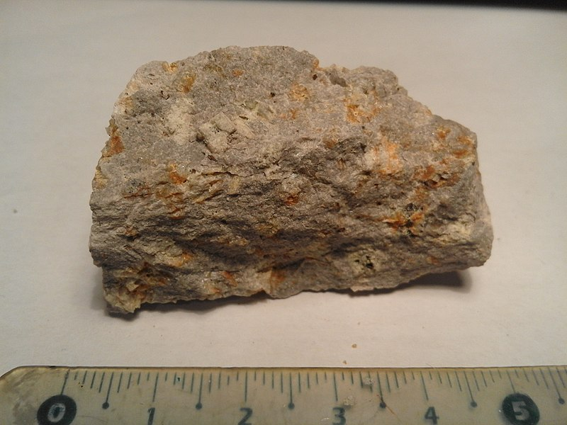

        - L'andésite $\alpha$

        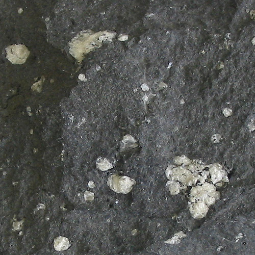

        - Le basalte $\beta$

        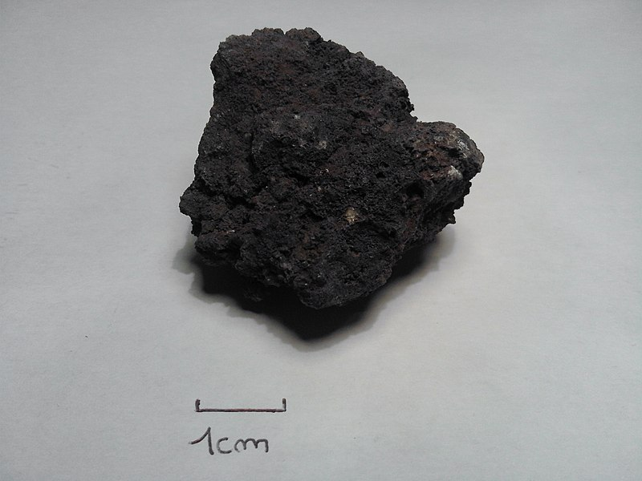

        - La labradorite $\lambda$

        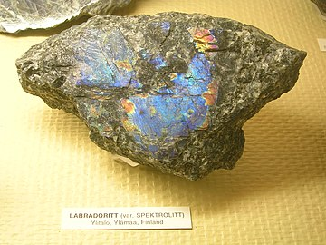

    - Anciennes (ou paléovolcanique) datant de l'ère primaire :
        - Le porphyre $\pi$

        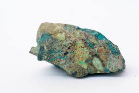

        - L'orthophyre $\mu$

        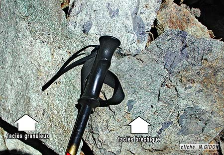

        - La porphyrite $\mu$

        

        - La mélaphyre $\theta$

        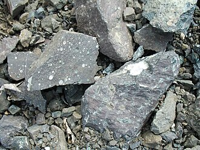

## Approche géomorphologique
