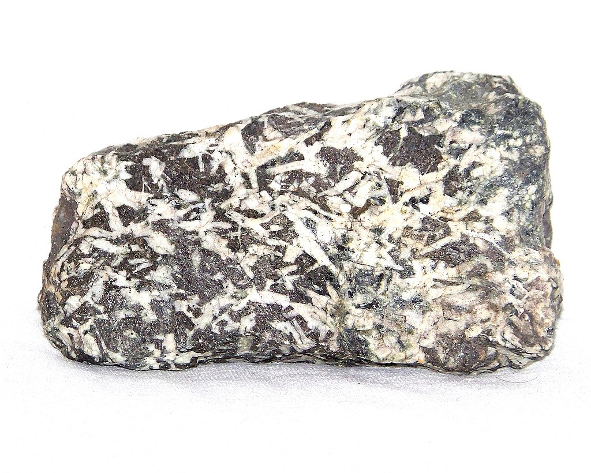
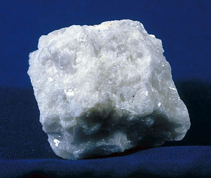
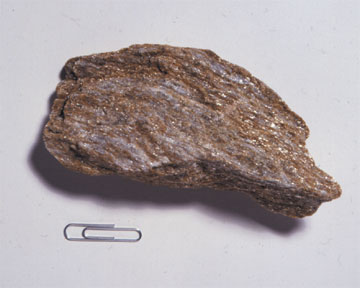

# Introduction à la géomorphologie

## Approche topographique des formes du relief

### Les montagnes

### Les plateaux

### Les plaines

## Approche géologique du relief

### La structure interne de la Terre

### La structure externe de la Terre : les roches

#### Classement des roches en fonction de leur origine

La géographie s'intéresse essentiellement aux éléments qui se trouvent en surface, le **sol** (ou la formation superficielle) qui correspond à des roches ameublies pénétrées et attaquées par la biosphère, qui les enrichissent en matière organique, mais également au **sous-sol** formé par les couches géologiques. La structure externe (sol et sous-sol) de la Terre est composée de nombreux matériaux appelés roches ayant une origine (1) soit interne, (2) soit externe, (3) soit mixte.

##### Les roches d'origine interne (ou endogènes ou ignites)

Les matériaux d'origine interne concernent ceux issus des matières visqueuses provenant de l'intérieur du globe, et projetées par lui. Ce sont les roches endogènes. Traditionnellement, on distingue les modelés issus d'une éruption, composés de **roches vulcaniques** (ou les vulcanites), la rhyolite, le trachyte, l'andésite et le basalte, des **roches plutoniques** (ou les plutonites), issues de la dénudation par l'érosion comme le granite, la syénite, la diorite, le gabbro. Les roches plutoniques se sont formées en profondeur à une certaine pression et une certaine température. Ce sont des roches entièrement cristallisées. Concernant les roches vulcaniques, si elles se solidifient près de la surface, elles forment des **roches cristallines** (granite, porphyre, *etc*.). Si elles se solidifient à l'air libre, comme une coulée de lave, les roches restent composées de cristaux, mais elles sont appelées roches éruptives (basalte, *etc*.). En général, elles sont fabriquées dans la cheminée d'un volcan. Les roches vulcaniques peuvent être recouvertes par des sédiments, si le volcan connaît une faible activité à l'échelle temporelle géologique.

- Les roches plutonites (ou intrusives)
    - Le granite $\gamma$

    

    - La syénite $\gamma\alpha$

    

    - La diorite $\theta$

    

    - Le gabbro $\mu$

    

- Les roches vulcanites (ou volcaniques)
    - Récentes datant de l'ère tertiaire :
        - La rhyolite $\pi$ (rhyolithe)

        

        - Le trachyte $\upsilon$

        

        

        - L'andésite $\alpha$

        

        - Le basalte $\beta$

        

        - La labradorite $\lambda$

        

    - Anciennes (ou paléovolcanique) datant de l'ère primaire :
        - Le porphyre $\pi$

        

        - L'orthophyre $\mu$

        

        - La porphyrite $\mu$

        

        - La mélaphyre $\theta$

        

##### Les roches d'origine externe (ou exogènes)

Les matériaux d'origine externe correspondent au résultat d'une accumulation lente au fond d'une mer, d'un lac ou d'une lagune de matières solides qui s'y trouvent en suspension. La notion de strates et de sédiment fut inventée par le danois Nicolas Sténon (1638-1686) dans son ouvrage *Prodromus* (1669). Il toucha également du doigt la notion d'érosion en remarquant l'importance de la circulation des fluides qui peuvent déposer ou retirer de la matière. Le dépôt se transforment en **roches sédimentaires** grâce à l'action de la pesanteur. En dehors de la pesanteur, les roches sédimentaires peuvent être obtenues (1) par la désagrégation d'autres roches (roches détritiques), (2) par la dissolution d'autres roches (roches chimiques) et (3) par la dissolution de matière organique (roches organiques). Quoi qu'il en soit, les roches sédimentaires se sont toutes formées dans des étendues d'eau. Les principales roches exogènes obtenues sont le calcaire, le sable, le grès, l'argile, *etc*.

- Roches calcaires

    - Craie

    - Calcaires en plaquettes

    - Calcaires massifs

- Roches argilo-calcaires

    - Marnes

    

- Roches argileuses

    - Argiles

    

    - Argilites

    - Schistes

    

- Roches argilo-siliceuses

    - Molasses

    

    

    - Flyschs

    

- Roches siliceuses

    - Sables

    - Grès calcaires

    - Grès silicieux

    

    - Poudingues

    

##### Les roches d'origine mixte (ou métamorphiques)

Les matériaux d'origine mixte sont à la fois constitués de cristaux et de couches parallèles, spécifiques aux roches sédimentaires. Elles peuvent s'obtenir par la suite d'un effondrement du sol ou par un recouvrement dû à une éruption volcanique. Le mélange entre en contact avec la matière interne soumise à une haute pression et une haute température. Ainsi, la roche sédimentaire a été partiellement ou totalement fondue. En se refroidissant, les roches sédimentaires se cristallisent tout en conservant leur stratification initiale. Ce sont les **roches métamorphiques** (ou roches cristallophyliennes), dont l'archétype est le gneiss. Il existe trois types de métamorphisme : le métamorphisme de contact dans les zones éruptives, le dynamométamorphisme dans les zones de contact tectonique, et le métamorphisme général ou régional qui s'opère en profondeur. Ce dernier a été provoqué par la remontée d'un bloc de granite. Le calcaire devient du marbre, l'argile du schiste, le sable du quartz, *etc*. Les principales roches métamorphiques sont : le gneiss, le micaschiste et le marbre.

- Roches d'origine calcaires

    - Marbres

    

    - Roches vertes

    

- Roches d'origines argileuses

    - Micaschistes

    

    - Gneiss

    

- Roches d'origine siliceuses

    - Quartzites

    

> [!WARNING]
> Il est important de noter que l'âge des roches n'indique pas la nature interne, externe ou mixte de la roche. L'âge ne permet pas non plus si la roche est dure ou tendre, perméable ou imperméable, riche ou pauvre en éléments fertilisants.

#### Classements des roches en fonction de leur texture

Un terrain est caractérisé par son degré de dureté, son degré de perméabilité et son degré de fertilité.

##### Classement des roches en fonction de leur degré de dureté

- Les roches magmatiques sont très dures et très résistantes.

- Les roches sédimentaires sont plus ou moins tendres.

##### Classement des roches en fonction de leur degré de perméabilité

##### Classement des roches en fonction de leur degré de fertilité

## Approche géomorphologique
