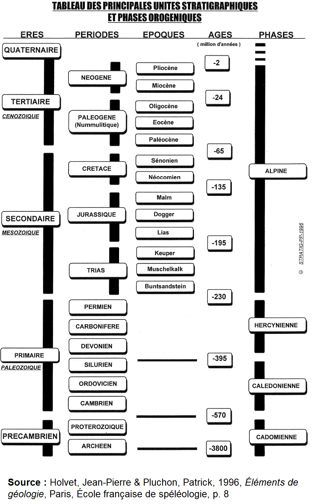

# Géomorphologie des formes du relief

## L'orogenèse (Rappels)

- Les auteurs principaux :
    - Alfred Lothar Wegener (1880-1930)
    - Harry Hammond Hess (1906-1969)
- La théorie de la dérive des continents
- La théorie de la tectonique des plaques

## L'érosion des reliefs (Rappels)

### Le processus d'érosion

### L'altération

#### Les actions mécaniques

#### Les actions chimiques

### Les actions biologiques

## Le transport

### Le transport particule par particule

### Le transport par mouvement de masse

### Le dépôt

## Le cycle davisien de l'érosion

- Les auteurs principaux :
    - William Morris Davis (1850-1934)
    - Henri Baulig (1877-1962)
    - Walther Penck (1888-1923)
    - Alain Reynaud (né en 1942)
- Le cycle davisien :
    1. L'orogenèse
    2. L'érosion active
    3. La pénéplaine

## Les types d'érosion

# Les reliefs et les ères géologiques

L'étude statique du relief est l'objet de la géomorphologie structurale. Plissements, dislocations et éruptions participent à l'orogenèse. Son explication est interne. Tout relief émergé subit des actions mécaniques ou chimiques conduisant à une profonde modification. Selon notre connaissance de la création de la Terre, il existe cinq périodes géologiques particulièrement orogénique :
1. le précambrien (4,5 milliards-600 millions d'années B.P.) ;
2. l'ère primaire ou le Paléozoïque (600-230 millions d'années B.P.) ;
3. l'ère secondaire ou le Mésozoïque (230-65 millions d'années B.P.) ;
4. l'ère tertiaire ou le Cénozoïque (65-3 millions d'années B.P.) ;
5. la néotectonique et la tectonique active de l'ère quaternaire (depuis 3 millions d'années B.P.).

Le précambrien est la plus longue période géologique connue. L'eau sur terre est apparue vers 4,4 milliards d'années B.P.
— Les plates-formes sont apparues vers 4 milliards d'années B.P.
— Le précambrien prend fin avec l'apparition de la vie.
— Le précambrien se divise en trois grandes périodes (les éons) :
1. l'hadéen (4,5-4 milliards d'années B.P.) ;
2. l'archéen (4-2,5 milliards d'années B.P.) ;
3. le protérozoïque (2,5-0,541 milliards d'années B.P.).

Le cambrien est l'éon actuel. Il est également appelé phanérozoïque. Cette éon est subdivisé en quatre ères.

L'ère primaire est subdivisée en six périodes différenciées par la température de la planète :
1. le cambrien (600-500 millions d'années B.P.) ;
2. l'ordovicien (500-440 millions d'années B.P.) ;
3. le silurien (440-395 millions d'années B.P.) ;
26 Géomorphologie des formes du relief
4. le dévonien (395-345 millions d'années B.P.) ;
5. le carbonifère (345-280 millions d'années B.P.) ;
6. le permien (280-230 millions d'années B.P.).

L'ère primaire est marquée par les premiers plissements, ce que l'on appelle les massifs anciens, par l'enrichissement de l'atmosphère en oxygène et par la formation du charbon et du pétrole (exploités actuellement). En fin de période, les masses continentales rentrent en collision pour former un unique continent, la Pangée, autour d'un océan, le Panthalassa.

Toute l'ère secondaire est marquée par la dislocation de la Pangée qui forme progressivement les continents actuels. Le climat est plutôt chaud sur l'ensemble de la planète. Elle est subdivisée en trois grandes périodes :
1. le trias (230-190 millions d'années B.P.) ;
2. le jurassique 1 (190-135 millions d'années B.P.) ;
3. le crétacé (135-65 millions d'années B.P.).

Le jurassique est marqué par l'ouverture de la Pangée dans laquelle est apparue la mer Téthys. Deux blocs apparaissent : la Laurasie (Amérique du Nord, Eurasie) et le Gondwana (Amérique du Sud, Afrique, Inde, Australie, Antarctique). Pendant le crétacé, l'océan Atlantique s'ouvrit.
1. Il se décompose entre trois périodes : jurassique inférieur (Lias), jurassique moyen (Dogger) et jurassique supérieur (Malm).

L'ère tertiaire est marquée par une nouvelle grande phase orogénique ; les continents gagnent leur position actuelle. Elle se subdivise en cinq périodes :
1. le paléocène (65-53 millions d'années B.P.) ;
2. l'éocène (53-37 millions d'années B.P.) ;
3. l'oligocène (37-25 millions d'années B.P.) ;
4. le miocène (25-10 millions d'années B.P.) ;
5. le pliocène (10-3 millions d'années B.P.).

La fin de la période tertiaire est marquée par l'apparition des hominidés. Vers 5 millions B.P., les austropithèques apparurent.

L'ère quaternaire est marquée par une alternance entre des périodes froides (les glaciations) et des périodes chaudes (les interglaciations). Cette alternance peut être différenciée en fonction de la localisation géographique. Ainsi, toutes les glaciations n'ont pas été synchrones entre elles. Elle est subdivisée en deux périodes :
1. le pléistocène (2,5-0,08 millions d'années B.P.) ;
2. l'holocène (à partir de 8 000 B.P.).

Lors des phases de glaciation du pléistocène, l'océan se contracte. Environ 74 millions de km3 d'eau ont été emprisonnés de 80 millions de km3 de glace au niveau d'un immense inlandsis. En phase de glaciation, le niveau des océans baisse. En l'occurrence, dans le cas présent, le niveau était de 120 m en deçà du niveau actuel. Pendant le pléistocène, les derniers mouvements tectoniques sont intervenus ; c'est ce que l'on appelle la néotectonique. Le terme ne doit pas être confondu avec la tectonique active qui correspond aux déformations de l'écorce terrestre avant jusque 10 000 ans B.P., c'est-à-dire celles de l'Holocène. L'Holocène est une phase interglaciaire ; la planète se réchauffe. C'est également une phase de sédimentation. Elle est caractérisée par une nouvelle forme d'érosion : l'érosion anthropique.

> [!NOTICE] Depuis quelques années, on souhaite ajouter l'ère de l'anthropocène. C'est une notion que ce cours n'utilisera pas.

La description des temps géologiques est dans le [*Guide du B.R.G.M.*](../Ressources/BRGM-Guide-de-lecture-de-la-carte-geologique-a-1-50-000.pdf) (p. 12).

# Les grands ensembles structuraux

- Plates-formes

- Boucliers

- Système plissé alpin

Il faut retenir que la Terre a connu quatre grands cycles orogéniques.
1. Phase cadomienne (3,8 milliards - 570 millions d'années B.P.)
2. Phase calédonienne (570 millions - 395 millions d'années B.P.)
3. Phase hercynienne (395 millions - 230 millions d'années B.P.)
4. Phase alpine (230 millions - 2 millions d'années B.P.) (cf. Système plissé alpin)

# Les plis, les failles et les fractures

## Les plis

## Les dislocations

### Les fractures

### Les failles
