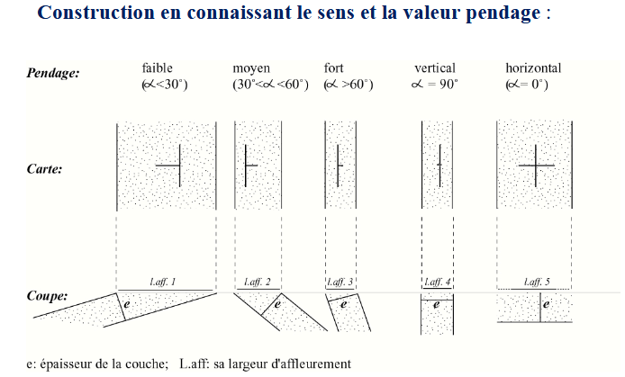

# Lecture d'une carte géologique - Ressources

Les cartes géologiques sont conçues par le [Bureau de Recherches Géologiques et Minières](https://www.brgm.fr/fr) (B.R.G.M.).

## Ressources

### Quelques tutoriels pour bien maîtriser les cartes géologiques

- [Lire une carte géologique](https://www.youtube.com/watch?v=-mIhfbmITns)

- [Lire une carte géologique](https://www.youtube.com/watch?v=PeoNeMFG37k&list=PLjepoOw2WVmh18Iv6bLIhYDUuqxojZIxS&index=7)

- [Lire une carte géologique](https://www.youtube.com/watch?v=EirOMRg_uNs&list=PLjepoOw2WVmh18Iv6bLIhYDUuqxojZIxS&index=12)

- [Lire une carte géologique](../Ressources/BRGM-Guide-de-lecture-de-la-carte-geologique-a-1-50-000.pdf) (pdf)

- [Construire une carte géologique](https://www.youtube.com/watch?v=OOI_A3BNQZk)

- [Construire une carte géologique](https://www.youtube.com/watch?v=8vcsZZnq9F0&list=PLAGFiOoRe1nMXDnTyisYRgUhljUQ5y0F5)

- [Mesurer un pendage sur le terrain](https://www.youtube.com/watch?v=6t6Px-urMI0)

- [Lire un pendage sur une carte géologique](https://www.youtube.com/watch?v=jUoxEQPul7Q)

- [Lire un pendage sur une carte géologique](https://www.youtube.com/watch?v=-MvyamY1iT8)

- [Réaliser une coupe géologique](https://www.youtube.com/watch?v=-MvyamY1iT8&list=PLjepoOw2WVmh18Iv6bLIhYDUuqxojZIxS&index=2)

- [Réaliser une coupe géologique](https://www.youtube.com/watch?v=QgzVB2_dkcM&list=PLjepoOw2WVmh18Iv6bLIhYDUuqxojZIxS&index=8)

- [Réaliser une coupe géologique](https://www.youtube.com/watch?v=iEtdPrqJbAQ)

- [Réaliser une coupe géologique](https://www.uca.ma/public/files/docs/site-164-7931e9d80e0b1a0dd62ea11a6ed22e5d-953882752.pdf) (pdf)

### Cartes géologiques en ligne

[Site du B.R.G.M.](https://infoterre.brgm.fr/viewer/MainTileForward.do)

> [!NOTE]
> Les notices et une partie des légendes sont inaccessibles sur le site du B.R.G.M.

## Symbole des cartes géologiques

- Ère primaire
	- k : Cambrien
	- o : Ordovicien
    - s : Silurien
    - d : Dévonien
    - h : Carbonifère
    - r : Permien
- Ère secondaire
    - t : Trias
    - l : Lias (Jurassique inférieur)
    - j : Jurassique (moyen et supérieur)
    - c ou n : Crétacé
- Ère tertiaire
	- g : Paléogène
    - e : Éocène et Oligocène inférieur
    - m : Oligocène supérieur et Miocène
    - p : Pliocène
- Ère quaternaire
	- q1-3 : Pléistocène
	- q4 : Holocène

Les cartes géologiques détaillent [chaque série (supérieure, moyenne, inférieure) et chaque étape](https://assistance.brgm.fr/sites/default/files/documents/guide_de_lecture_de_la_carte_geologique_a_1_50_000.pdf) (p. 12).

> [!NOTE]
> Il vous sera autorisé d'utiliser la page 12 citée, et uniquement cette page, lors de l'examen.

Les types de roche :

- $\gamma$ pour les granites (roches plutonites)
- $\gamma\alpha$ pour les syrénites (roches plutonites)
- $\beta$ pour les diorites (roches plutonites)
- $\gamma$ pour les gabbros (roches plutonites)
- $\sigma$ pour les rhyosites (roches vulcanites récentes)
- $\upsilon$ pour les trachytes (roches vulcanites récentes)
- $\alpha$ pour les andésites (roches vulcanites récentes)
- $\delta$ pour les basaltes (roches vulcanites récentes)
- $\lambda$ pour les labradonites (roches vulcanites récentes)
- $\pi$ pour les porphyres (roches vulcanites anciennes)
- $\mu$ pour les orthophyres (roches vulcanites anciennes)
- $\mu$ pour les porphyrites (roches vulcanites anciennes)
- $\theta$ pour les mélaphyres (roches vulcanites anciennes)
- *Q* pour les quartz
- *etc*.

## Les coupes géologiques

[Lecture d'une carte géologique du B.R.G.M.](https://assistance.brgm.fr/sites/default/files/documents/guide_de_lecture_de_la_carte_geologique_a_1_50_000.pdf)

[Lire le pendage d'une couche géologique sur une carte](https://www.youtube.com/watch?v=9pUgAbqf48M)

[Méthodologie pour réaliser une coupe géologique](https://acces.ens-lyon.fr/acces/thematiques/limites/ecoles/parcours/chartreuse/licence-de-sciences-de-la-terre-1/deroulement-materiel/coupe-geologique)

")

## Les roches

## Les cartes géomorphologiques
