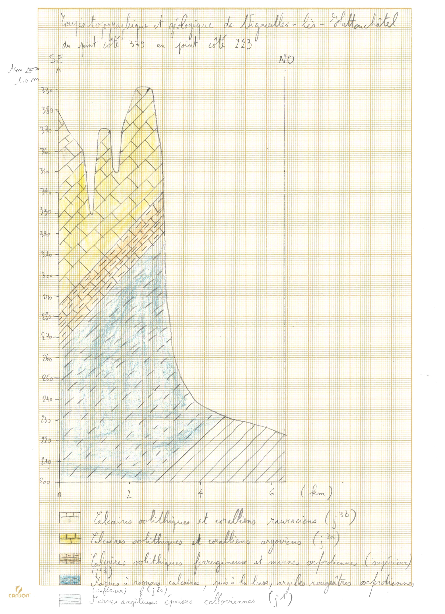

# Le Bassin parisien

## Ressources

- [Introduction sur le Bassin parisien](https://www.youtube.com/watch?v=OS8sEBWY5uA)

- [Le craton du Bassin parisien](https://www.youtube.com/watch?v=jd6LGWdf3Tg)

- [Les cuestas](https://www.youtube.com/watch?v=vXmxenZfhQg)

## Talus et coteaux

## Cuestas

Carte géologique simplifiée de Vigneulles-lès-Hattonchâtel (Meuse, 55)

1. Repérer le sens des écoulements.
2. Repérer le pendage général? De quelle nature est-il ?
3. Faire la coupe topographique entre A et B ?
4. Compléter la coupe topographique par une coupe géologique ?
5. Commenter le résultat obtenu. Quelle est la forme structurale présente sur cette carte ?
    - Analyser le profil topographique. Plaine ? Vallée ? Plateau ? Montagne ?
    - Analyser la coupe géologique. Comment se disposent les couches ?
    - Déduire la structure. Ici, une cuesta.
    - Analyser le réseau hydrographique. Quel cours d'eau est cataclinal ? orthoclinal ? anaclinal ?

## Boutonnière

Carte géologique simplifiée de Neuf-Marché (Seine-Maritime, 76)

1. Faire la coupe topographique entre A, B et C.
2. Compléter la coupe topographique par une coupe géologique.
3. Commenter le résultat obtenu. Que peut-on en déduire ?
