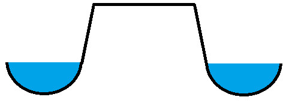
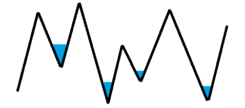
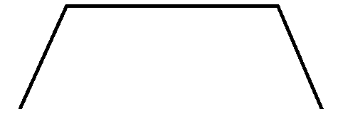

# Correction du Q.C.M.

## Résultats

66 copies pour l’ensemble des deux groupes
- Moyenne :07,80/20

Groupe 4 :
- Nombre de copies : 37
- Moyenne : 05,78/20
- Note minimale : 03/20
- Note maximale : 14/20
- Nombre de notes au-dessus de 10/20 : 6

Groupe 5 :
- Nombre de copies : 29
- Moyenne : 07,73/20
- Note minimale : 03/20
- Note maximale : 17/20
- Nombre de notes au-dessus de 10/20 : 12

## Qu'étudie la géomorphologie ?

1. La topologie et la géométrie
2. La topographie
3. La géologie
4. La climatologie

Score de bonne réponse : 1,52 %
- Groupe 4 : 2,70 %
- Groupe 5 : 0,00 %

Bonne(s) réponse(s) : 1, 2, 3

## Qu'est-ce qu'un plateau ?

1. 

2. 

3. 

4. 

Score de bonne réponse : 28,79 %
- Groupe 4 : 16,22 %
- Groupe 5 : 44,83 %

Bonne(s) réponse(s) : 2

Seuls les cours d'eau vous permettent de distinguer une plaine (1) d'un plateau (2). (3) est une chaîne de montagnes. (4) peut être une surface d'aplanissement.

## Combien existe-t-il de plaques à l'échelle de la planète ?

1. 10
2. 11
3. 12
4. 13

Score de bonne réponse : 54,55 %
- Groupe 4 : 54,05 %
- Groupe 5 : 55,17 %

Bonne(s) réponse(s) : 3 (Eurasie, Amérique du Nord, Amérique du Sud, Afrique, Indo-Australie, Antarctique, Pacifique, Nazca, Cocos, Caraïbes, Philippines et Arabie)

## Quelle roche est (ou quelles roches sont) d'origine interne ?

1. Granite
2. Gneiss
3. Schiste
4. Calcaire

Score de bonne réponse : 22,73 %
- Groupe 4 : 21,62 %
- Groupe 5 : 24,14 %

Bonne(s) réponse(s) : 1

(2) et (3) sont des roches métamorphiques (externes et internes). (4) est une roche sédimentaire (externe). 

## Combien existe-t-il de type de roches sédimentaires ?

1. 1
2. 2
3. 3
4. 4

Score de bonne réponse : 62,12 %
- Groupe 4 : 64,86 %
- Groupe 5 : 58,62 %

Bonne(s) réponse(s) : 3 (calcaire, silice, argile)

## Quelle carte (ou quelles cartes) utilise-t-on en géomorphologie ?

1. Les cartes touristiques
2. Les cartes topographiques
3. Les cartes routières
4. Les cartes géologiques

Score de bonne réponse : 74,24 %
- Groupe 4 : 70,27 %
- Groupe 5 : 79,31 %

Bonne(s) réponse(s) : 2, 4

## Quels sont le ou les découvreurs de la tectonique des plaques ?

1. Alfred Lothar Wegener
2. William Morris Davis
3. Henri Baulig
4. Harry Hammond Hess

Score de bonne réponse : 30,30 %
- Groupe 4 : 18,92 %
- Groupe 5 : 44,83 %

Bonne(s) réponse(s) : 1, 4

## Comment s'appelle le processus sculptant les reliefs terrestres à l'échelle temporelle géologique ?

1. La collusion
2. L'accrétion
3. L'érosion
4. La subduction

Score de bonne réponse : 83,33 %
- Groupe 4 : 83,78 %
- Groupe 5 : 82,76 %

Bonne(s) réponse(s) : 3

## Sans perturbation, combien d'étapes suit le cycle davisien ?

1. 3
2. 4
3. 5
4. 6

Score de bonne réponse : 31,82 %
- Groupe 4 : 37,84 %
- Groupe 5 : 24,14 %

Bonne(s) réponse(s) : 3 (orogenèse, glyptogenèse, pénéplaine)

## Pendant quelle ère géologique s'est formée la craie (ou le calcaire) ?

1. Cambrien
2. Carbonifère
3. Pliocène
4. Crétacé

Score de bonne réponse : 54,55 %
- Groupe 4 : 43,24 %
- Groupe 5 : 68,97 %

Bonne(s) réponse(s) : 4

## Quels éléments structuraux datent de l'ère primaire ?

1. Les bassins sédimentaires
2. Les boucliers
3. Les massifs anciens
4. Les systèmes plissés alpins

Score de bonne réponse : 16,67 %
- Groupe 4 : 16,22 %
- Groupe 5 : 17,24 %

Bonne(s) réponse(s) : 2, 3

## Quels sont les éléments d'un pli terrestre ?

1. Un synclinal
2. Un anticlinal
3. Une charnière
4. Un géosynclinal

Score de bonne réponse : 22,73 %
- Groupe 4 : 24,32 %
- Groupe 5 : 20,69 %

Bonne(s) réponse(s) : 1, 2, 3

## Une structure de type horst/graben a pour origine :

1. un pli
2. une fracture
3. une faille
4. un chevauchement

Score de bonne réponse : 39,39 %
- Groupe 4 : 32,43 %
- Groupe 5 : 48,28 %

Bonne(s) réponse(s) : 3

## Les lignes de même altitude sont appelées :

1. des isohypses
2. des isobathes
3. des points côtés
4. des courbes de niveau

Score de bonne réponse : 13,64 %
- Groupe 4 : 8,11 %
- Groupe 5 : 20,69 %

Bonne(s) réponse(s) : 1, 4

## Quel appareil mesure le pendage d'une couche géologique ?

1. La boussole
2. Le compas
3. Le rapporteur
4. L'inclinomètre

Score de bonne réponse : 63,64 %
- Groupe 4 : 67,57 %
- Groupe 5 : 58,62 %

Bonne(s) réponse(s) : 4

## Dans quelle phase orogénique la planète est-elle ?

1. La phase cadomienne
2. La phase calédonienne
3. La phase hercynienne
4. La phase alpine

Score de bonne réponse : 59,09 %
- Groupe 4 : 51,35 %
- Groupe 5 : 68,97 %

Bonne(s) réponse(s) : 4

Les phases orogéniques sont énoncées dans le bon ordre.

## Quels éléments font partie d'un relief jurassien ?

1. Une combe
2. Un crêt
3. Une avant-butte
4. Un horst

Score de bonne réponse : 18,18 %
- Groupe 4 : 16,22 %
- Groupe 5 : 20,69 %

Bonne(s) réponse(s) : 1, 2

## Quels éléments font partie d'un relief de cuesta ?

1. Une butte-témoin
2. Un avers
3. Un front
4. Un revers

Score de bonne réponse : 45,45 %
- Groupe 4 : 29,73 %
- Groupe 5 : 65,52 %

Bonne(s) réponse(s) : 1, 3, 4

## Le bassin parisien est :

1. un pli
2. un bassin sédimentaire
3. une faille
4. un bassin intracratonique

Score de bonne réponse : 22,73 %
- Groupe 4 : 18,92 %
- Groupe 5 : 27,59 %

Bonne(s) réponse(s) : 2, 4

## Sans perturbation, quelle est la séquence d'érosion d'un relief plissé ?

1. Appalachien / Préalpin / Jurassique
2. Jurassien / Appalachien / Préalpin
3. Jurassien / Préalpin / Appalachien
4. Jurassique / Préalpin / Appalachien

Score de bonne réponse : 34,85 %
- Groupe 4 : 24,32 %
- Groupe 5 : 48,28 %

Bonne(s) réponse(s) : 3
